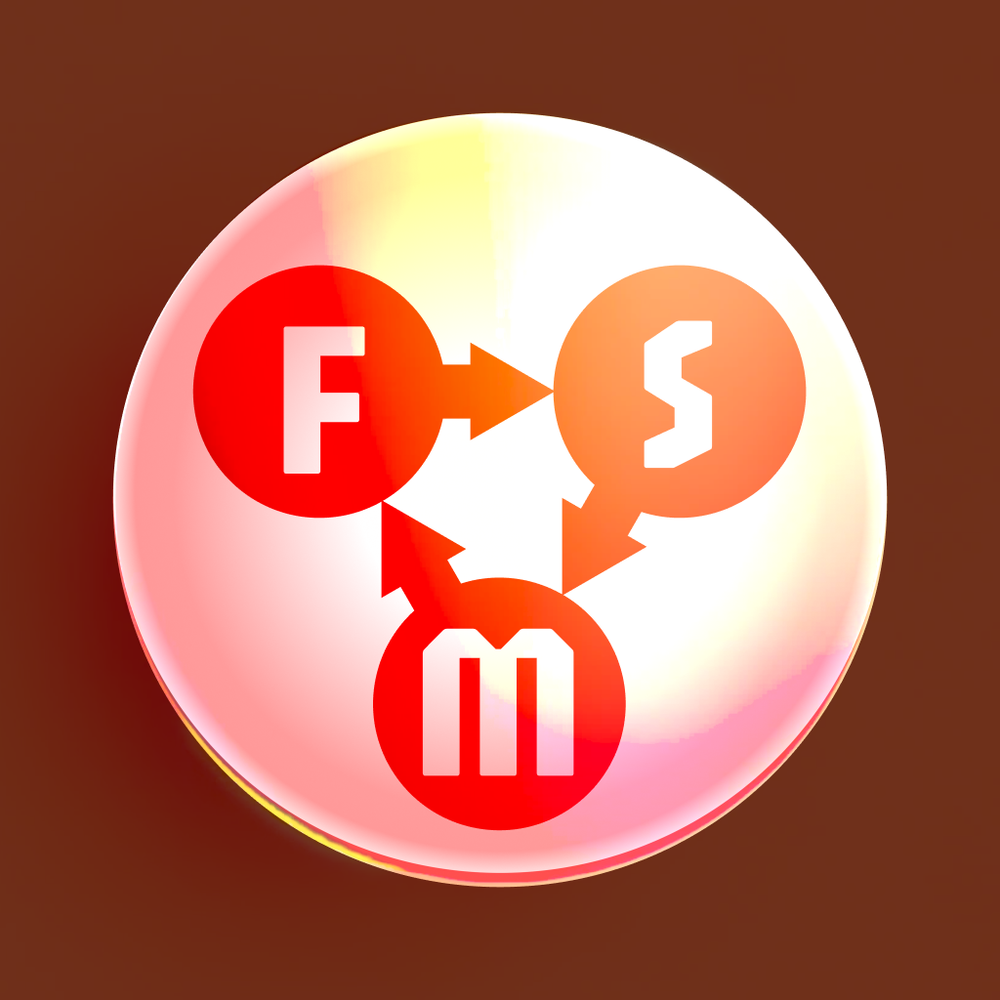

<br>
# Better FSM
<i>A simple finite state machine. Set a state, react to enter and exit triggers, and push or pop states on a stack.</i> <br>
### Version 1.0.1.0

[](https://github.com/skymen/fsm/releases/download/skymen_fsm-1.0.1.0.c3addon/skymen_fsm-1.0.1.0.c3addon)
<br>
<sub> [See all releases](https://github.com/skymen/fsm/releases) </sub> <br>

#### What's New in 1.0.1.0
- **Changed:** Properly exposed SetState to the scripting runtime
- **Changed:** Minor codebase adjustments

<sub>[View full changelog](#changelog)</sub>

---
<b><u>Author:</u></b> skymen <br>
<b>[Construct Addon Page](https://www.construct.net/en/make-games/addons/1701/better-fsm)</b>  <br>
<b>[Documentation](https://www.construct.net/en/make-games/addons/1701/better-fsm)</b>  <br>
<sub>Made using [CAW](https://marketplace.visualstudio.com/items?itemName=skymen.caw) </sub><br>

## Table of Contents
- [Usage](#usage)
- [Examples Files](#examples-files)
- [Properties](#properties)
- [Actions](#actions)
- [Conditions](#conditions)
- [Expressions](#expressions)
---
## Usage
To build the addon, run the following commands:

```
npm i
npm run build
```

To run the dev server, run

```
npm i
npm run dev
```

## Examples Files
| Description | Download |
| --- | --- |
| fsm-example | [](https://github.com/skymen/fsm/raw/refs/heads/main/examples/fsm-example.c3p) |

---
## Properties
| Property Name | Description | Type |
| --- | --- | --- |
| Initial state | The state the instance starts in. | text |
| Trigger initial state | Fire 'On state enter' for the initial state on the first tick after the instance is created. | check |


---
## Actions
| Action | Description | Params
| --- | --- | --- |
| Clear stack | Remove every state from the stack. The current state is not changed. |  |
| Pop state | Switch back to the most recently pushed state and remove it from the stack. Does nothing if the stack is empty. |  |
| Push state | Remember the current state on the stack, then switch to the given state. | State             *(string)* <br> |
| Set state | Switch to a state. Does nothing if it is already the current state. | State             *(string)* <br> |


---
## Conditions
| Condition | Description | Params
| --- | --- | --- |
| Is stack empty | True if no states have been pushed. |  |
| Is in state | True if the current state matches. | State *(string)* <br> |
| On any state change | Triggered after the instance enters any state. |  |
| On state enter | Triggered after the instance enters a state. | State *(string)* <br> |
| On state exit | Triggered just before the instance leaves a state. CurrentState still returns the state being left. | State *(string)* <br> |


---
## Expressions
| Expression | Description | Return Type | Params
| --- | --- | --- | --- |
| StackSize | Number of states on the stack. | number |  | 
| StackState | The state at the given stack index. 0 is the bottom of the stack. Returns an empty string if the index is out of range. | string | Index *(number)* <br> | 
| CurrentState | The current state. | string |  | 
| PreviousState | The state before the current one. Empty if there was none. | string |  | 
| TimeInState | Seconds of game time spent in the current state. | number |  | 


---
## Changelog

**1.0.1.0**
- **Changed:** Properly exposed SetState to the scripting runtime
- **Changed:** Minor codebase adjustments

**1.0.0.0**
- **Added:** First release: set state, enter/exit/change triggers, is-in-state, state stack, state and timing expressions.
